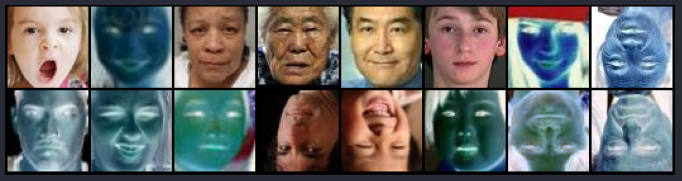
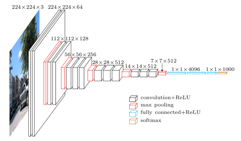
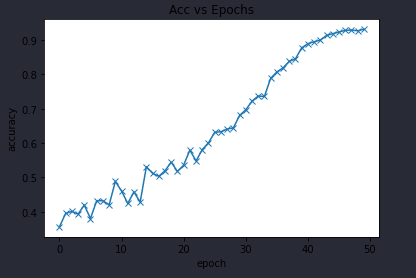
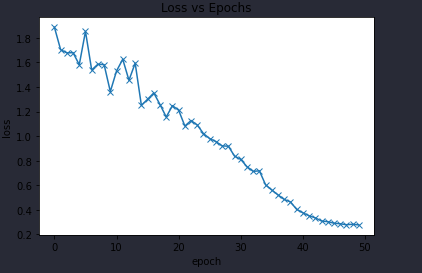
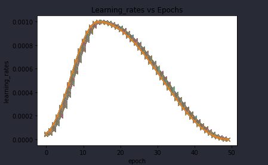

# Classification of high aged persons.
#### Data is mixture of some datasets from kaggle and  some other sites.
## Data Preprocessing
### 1) Inverted and Flipped Images for some noise.
### 2) Resized Images to 64x64
## Final Data Batch

## Classes
### 1) Adult
### 3) Senior Citizen
### 4) Youngster
# Model
### I  created a custom ResNet model from pytorch.

# Training Process
### Accuracy

### Loss

### Learning rate decay

# Run on your own desktop
```
pip install opencv-python
pip install torch torchvision pillow matplotlib
python3 cv_age.py cam
```
##### Note: use cam as argument for using yuor own camera.
