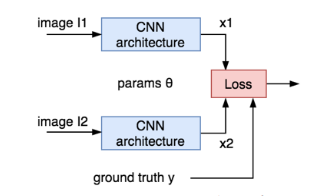

# Classification of high aged persons.
#### Data is mixture of some datasets from kaggle and  some other sites.

# Model
### We will use famous VGG16 pre-trianed network to extract features.

### Finding similar images using extracted features.
#### We will use euclidean distance loss to calculate similarities between images.

# Run on your own desktop
```
open human_ageing_smililarites.ipynb
add all your images to demo folder and run all cellls.
```

