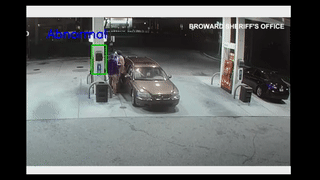
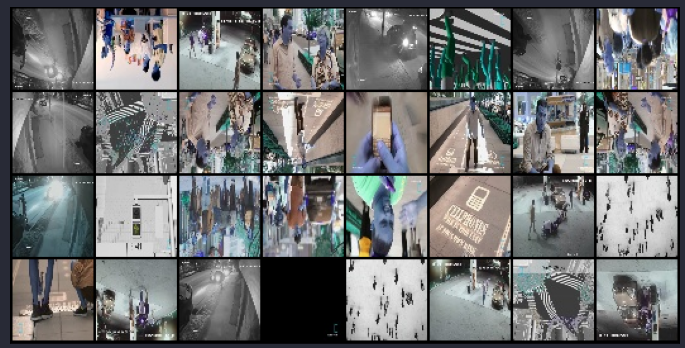
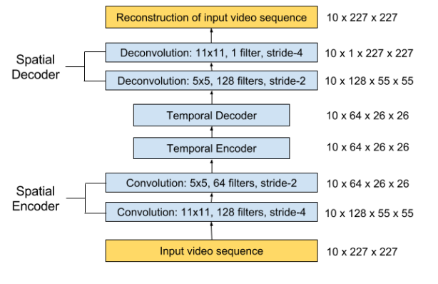

# Human Behaviour classification

## Dataset
### I downloaded some fighting videos from youtube and took snapshots to train model.
### Processing
#### 1) Took snapshots
#### 2) Resized to 64x64
## Data Batch

## Model Used
### I created a custom resnet model using pytorch

## Run on your own Desktop
```
pip install torch torchvision pillow opencv-python matplotlib
python3 cv_behaviour.py [cam]
```
#### Note : use cam as argument for own video camera else it will use default video.
