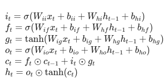
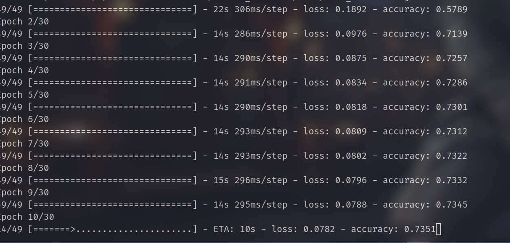

# Human Behaviour classification
### Implemented with spatial diffrence Learning.(New)

## Dataset
### I Used the Avenue Datset.
### Processing
#### 1) Took every one frame after skipping one.
#### 2) Grayscaled and resized to 227x227

## Model Used
### I created a custom resnet model using pytorch

### LSTM Layer

### Training
#### ACC was 73% with 30 epochs.

## Run on your own Desktop
#### Open .ipynb notebook and run predict_anomly function
