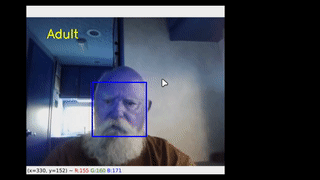
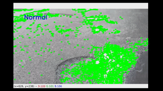

# StudyMonk Tests
## 1) Human Behaviour detection.
### Implemented with STD
## 2) Ageing Face classifier.

 

## 3) Pothole Detection.


## Requirements
```
pip install torch torchvision opencv-python numpy matplotlib
cd to/the/directory/
python cv_/pro.py
```
### Note : All three of them are created in just three days with self-collected datasets.
