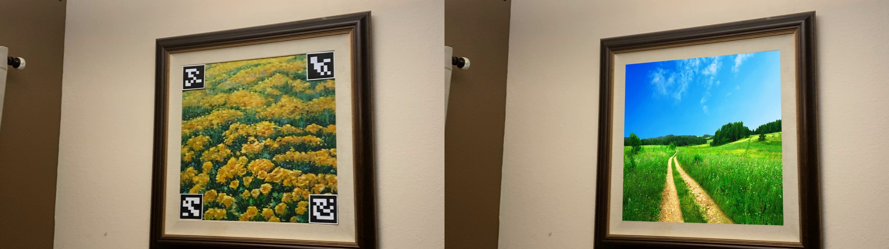

# AR with Aruco
> See how it works



## How to setup ?

```bash
cd path/to/folder
python -m pip install -r reuqirements.txt
```
## How to run ?
* For image
```
python augmented_reality_with_aruco.py --image YOUR_IMAGE.JPG
```
* For Video
```
python augmented_reality_with_aruco.py --video YOUR_VIDEO.mp4
```
