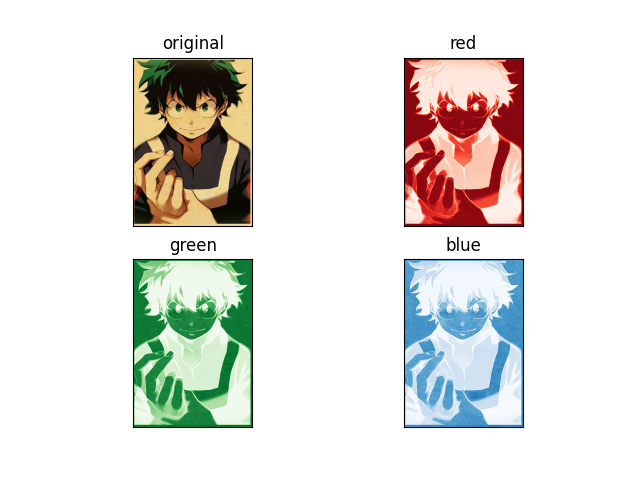

# Image Color Channel Splitter

> Splits Image into 3 Color Channels.



## How to setup ?
```bash
cd path/to/dir
python -m pip install -r requirements.txt
```

Run ```python -m streamlit run Image_splitter.py```