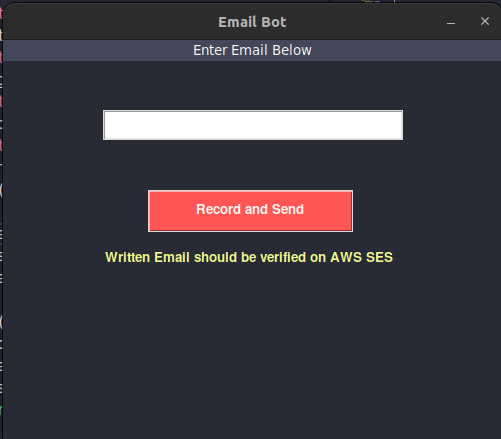

# Voice operated Email
>Takes inputs from voice and send Mail using AWS SES.




## How to run?

```bash
cd /path/to/directory
python3 -m pip install requirements.txt
python3 main.py
```
## You have to add you own AWS SES keys to environment.

```bash
export AWS_ACCESS_KEY_ID="key ID here"
export AWS_SECRET_ACCESS_KEY="key here"
```
> add verified sender address to the ```record_and_send()``` function
