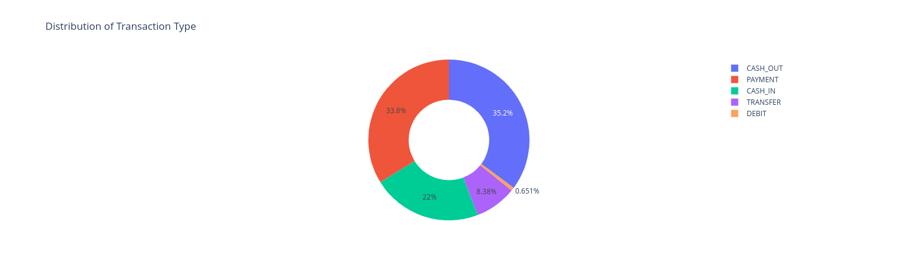

# Fraud Detection using ML

> Detects a fraud from bank data inputs.

> Dataset used [Here](https://www.kaggle.com/ealaxi/paysim1/download)



## How to setup ?
```bash
cd /path/to/folder
python -m pip install -r requirements.txt
```
> Run in jupyter notebook