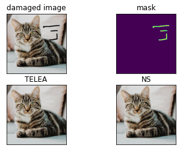

# Image Repair Using Computer Vision

> Using Open CV to Repair Damaged Images



## How to Setup ?
```bash
cd /path/to/dir
python -m pip install -r requirements.txt
```

RUN : ```Open in Jupyter Notebook```