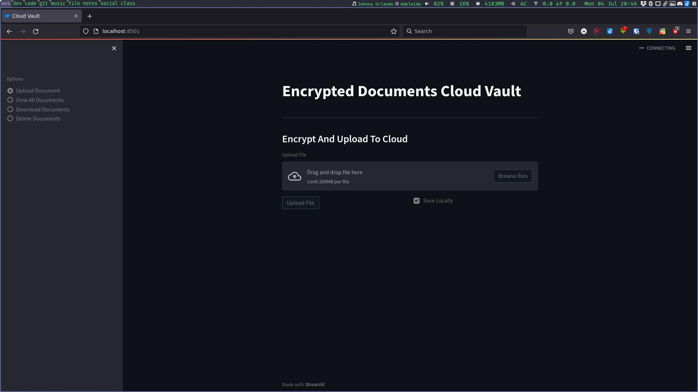

# AWS S3 Storage Web App Using Streamlit

* Stores Doccument on AWS S3
* Server Side encryption
* One click download


## How to setup (linux only) ?
> Get you AWS_SECERT_ACCESS_KEY and AWS_ACCESS_KEY_ID from you AWS Account
```bash
mkdir ~/.aws
cd ~/.aws
touch credentials config
```
### Open ```credentials``` file in any text editor and paste this:
```
[default]
aws_access_key_id = YOUR_ACCESS_KEY_ID
aws_secret_access_key = YOUR_SECRET_ACCESS_KEY
```
### Open ```config``` file in any text editor and paste this:
```
[default]
region = your_service_region
```
## How to setup (Windows) ?
> Create upper same files like this ```C:\Users\USER_NAME.aws\credentials``` and paste same content.

## How to run ?

```bash
python3 -m pip install -r requirements.txt
cd path/to/folder
python3 -m streamlit run main.py
```