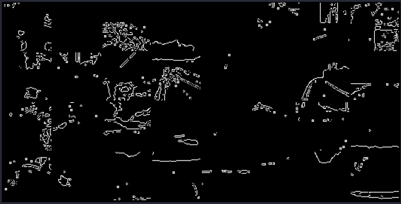
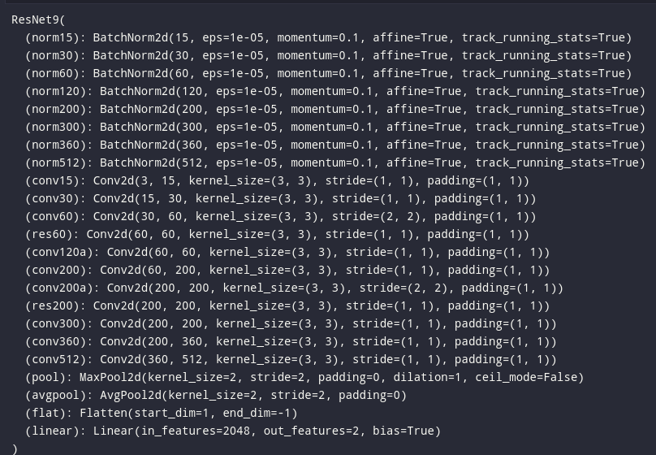
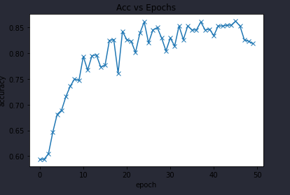
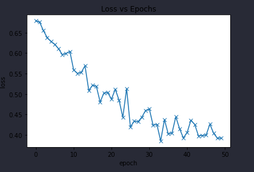
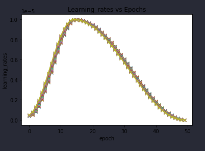

## Pothole Detection using Deep neural networks and OpenCV
#### Data is gathered from randmo sites.
## Data Preprocessing
### 1) Thresholding
### 2) Finding Edges
### 3) Resizing
## FInal data batch used for training


## Model Used
### I Created a custom ResNet model using pytorch

## Training Process
#### Accuracy

#### Loss

#### Learning rate decay

# Implementing in OpenCV

# Run on your desktop
```
pip install opencv-python
pip install torch torchvision pillow matplotlib
python3 cv_pothole.py cam
```
##### Note: use cam for using your own camera else it will use a default video.
