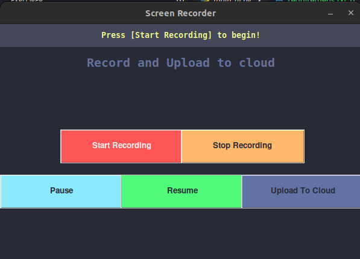
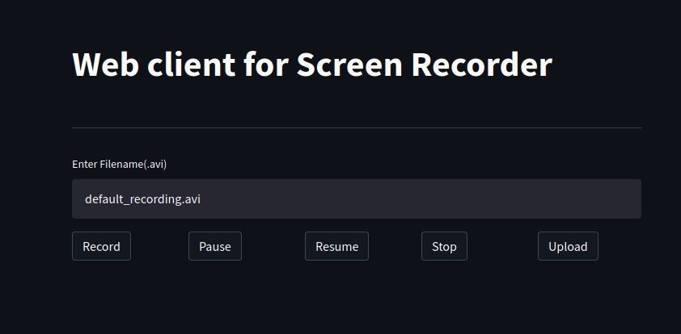

# Screen Recorder with S3 extension

> You can record screen and upload it to you AWS S3 bucket in a click to share publicly.



## How to setup?
```bash
cd /path/to/dir
python3 -m pip install requirements.txt
```
## Running tkinter GUI
```bash
python3 main_ui.py
```
## Running Web client(based on streamlit)
```bash
streamlit run web_test.pyw
```

### You have to add your S3 bucket name in ```upload_file()``` function.