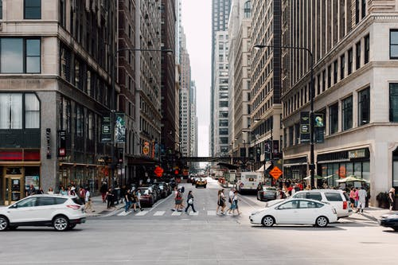

# Image to Sketch Converter using Open CV

 


## How to setup ?
```bash
python -m pip install -r requirements.txt
```
## How to run ?
```
usage: main.py [-h] --img IMG [--show SHOW] [--out OUT]

options:
  -h, --help   show this help message and exit
  --img IMG    Image Path
  --show SHOW  Add this tag if you also want to see image
  --out OUT    Name for file in which Sketch to be saved
```